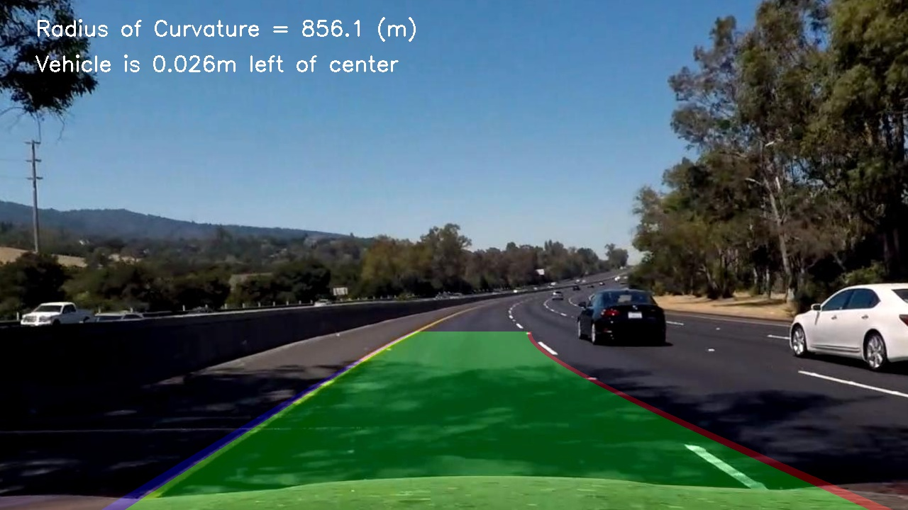

## Writeup Template

**Advanced Lane Finding Project**

The goals / steps of this project are the following:

- [x] Compute the camera calibration matrix and distortion coefficients given a set of chessboard images.
- [x] Apply a distortion correction to raw images.
- [x] Use color transforms, gradients, etc., to create a thresholded binary image.
- [x] Apply a perspective transform to rectify binary image ("birds-eye view").
- [x] Detect lane pixels and fit to find the lane boundary.
- [x] Determine the curvature of the lane and vehicle position with respect to center.
- [x] Warp the detected lane boundaries back onto the original image.
- [x] Output visual display of the lane boundaries and numerical estimation of lane curvature and vehicle position.

[//]: # (Image References)

[image1]: ./output_images/undistort_calibration1.jpg "Undistorted"
[image2]: ./output_images/undistort_test3.jpg "Road Transformed"
[image3]: ./output_images/combined_binary_1.jpg "Binary Example"
[image4]: ./output_images/warping.jpg "Warp Example"
[image5]: ./output_images/polynomial_fit.jpg "Fit Visual"
[image6]: ./output_images/tracked1.jpg "Output"
[video1]: ./output1_tracked.mp4 "Video"

## [Rubric](https://review.udacity.com/#!/rubrics/571/view) Points

### Here I will consider the rubric points individually and describe how I addressed each point in my implementation.  

---
### Writeup / README

In this write-up I explain how I approached the Rubric Points of the Project 2.
### Camera Calibration

#### 1. Briefly state how you computed the camera matrix and distortion coefficients. Provide an example of a distortion corrected calibration image.

The code for this step is contained `P2_compute_camera_calibration.py`. 

I start by preparing "object points", which will be the (x, y, z) coordinates of the chessboard corners in the world. Here I am assuming the chessboard is fixed on the (x, y) plane at z=0, such that the object points are the same for each calibration image.  Thus, `objp` is just a replicated array of coordinates, and `objpoints` will be appended with a copy of it every time I successfully detect all chessboard corners in a test image.  `imgpoints` will be appended with the (x, y) pixel position of each of the corners in the image plane with each successful chessboard detection.  

I then used the output `objpoints` and `imgpoints` to compute the camera calibration and distortion coefficients using the `cv2.calibrateCamera()` function.  I applied this distortion correction to the test image using the `cv2.undistort()` function and obtained this result: 

The picture was created using the Notebook "Project2Notebook.ipynb" by uncommenting the code line:
    #plt.savefig('output_images/undistort_calibration1.jpg')

![Distortion Correction][image1]

### Pipeline (single images)

#### 1. Provide an example of a distortion-corrected image.

To demonstrate this step, I will describe how I apply the distortion correction to one of the test images like `test_images/test3.jpg`:

``` python
# Apply it to test-image
img = mpimg.imread('test_images/test3.jpg')
undist = cal_undistort(img,mtx,dist)

f, (ax1,ax2) = plt.subplots(1,2, figsize=(24,9))
f.tight_layout()
ax1.imshow(img)
ax1.set_title('Original Image', fontsize=30)
ax2.imshow(undist)
ax2.set_title('Undistorted Image', fontsize=30)
plt.subplots_adjust(left=0., right=1, top=0.9, bottom=0.)
plt.savefig('output_images/undistort_test3.jpg')

```

![alt text][image2]

#### 2. Describe how (and identify where in your code) you used color transforms, gradients or other methods to create a thresholded binary image.  Provide an example of a binary image result.

I used a combination of color and gradient thresholds to generate a binary image (thresholding steps at lines #69 through #99 in `P2.py`).  Here's an example of my output for this step, applied to `test1.jpg`.

<table><tr>
<td>  </td>
<td>  </td>
</tr></table>

#### 3. Describe how (and identify where in your code) you performed a perspective transform and provide an example of a transformed image.

The code for my perspective transform includes a function called `warp_the_image(img_in, src, dst):`, which appears in lines #109 through #116 in the file `P2.py`. Output of that function is located in `./output_images/combined_binary_*.jpg`.   The `warper()` function takes as inputs an image (`img`), as well as source (`src`) and destination (`dst`) points.  I chose the hardcode the source and destination points in the following manner based on the Udacity-Help-Forum. Unfortunately I saw the proposal here in the write-up only later. Since these values perform quite well, I just take them. I faced the issue, that it is relevant how I choose the points: left-top, left-bottom ... Finaly I also succeeded by using the input from the course, but this would have been a hard time to debug without this help.

```python
# Input help forum
src_line =  [[568,468],
     [715,468],
     [1040,680],
     [270,680]]

# Perspective Transform requires float, cv2.line requires int

dst_line = [[200,0],
      [1000,0],
      [1000,680],
      [200,680]]
```


I verified that my perspective transform was working as expected by drawing the `src` and `dst` points onto a test image and its warped counterpart to verify that the lines appear parallel in the warped image. The image was created using the Notebook "Project2Notebook.ipynb".

![alt text][image4]

#### 4. Describe how (and identify where in your code) you identified lane-line pixels and fit their positions with a polynomial?

Then I did some other stuff and fit my lane lines with a 2nd order polynomial kinda like this:

![alt text][image5]

In order to do this, I played with the different approaches provided in the course and finaly watched the FAQ session, provided by [Udacity](https://www.youtube.com/watch?v=vWY8YUayf9Q). Based on the presented convolution approach, I first chose to simply use the first discussed sliding window approach and apply this in the file `P2.py` in the function `find_lane_pixels_window(binary_warped)`, lines #119 through #204. This was commited for Review #2. 

The function returns the values:
```python 
return leftx, lefty, rightx, righty, dbg_lane_px_img
```
leftx and lefty represent the pixels, marked for the left line visualized by the red points in the image. The same for rightx and righty. The picture dbg_lane_px_img is nearly the printed output. The missing application of the polyfitted Polynomial, that is also shown in the pictue is printed using the debug-mode of VS-Code. I stopped the output with the debugger and called the code:

```python
plt.imshow(dbg_lane_px_img)
plt.plot(left_fitx,ploty)
plt.plot(right_fitx,ploty)
plt.savefig('output_images/polynomial_fit.jpg')
```

#### 5. Describe how (and identify where in your code) you calculated the radius of curvature of the lane and the position of the vehicle with respect to center.

I did this in the function `measure_curvature_real(left_fitx, right_fitx, ploty, ym_per_pix, xm_per_pix)`, lines #358 through #374 in my code in `P2.py`

As marked tbd. I took the xm_per_pix and y correlation from the course. From reading around the argumentation goes for: Check how a real measure and the pixels correlated. For the sake of time I did not dig here any deeper.

Applying the Formula and Description provided in the course was quite straight forward, I spent some time thinking on: Shall I use left_curverad or right_curverad for the display. By watching the previously watched video I came to choose for left_curverad. 

Also the code for calculating the center-calculation I have learned from the video.

#### 6. Provide an example image of your result plotted back down onto the road such that the lane area is identified clearly.

I implemented this step in lines #402 through #417 in my code in `P2.py` in the function `process_image(img_in)`.  Here is an example of my result on a test image:

<table><tr>
<td>  </td>
<td>  </td>
</tr></table>

<table><tr>
<td>  </td>
<td>  </td>
</tr></table>

The pictures show two examples, in the folder `output_images` the pictures `test*.jpg` are outputted with the pipleine in `P2.py` lines #428 .. #450 and written to `tracked*.jpg` annotaded withe the warped lines. The pictures show still some imperfections, but perform reasonably well.

As a prequisite for applying it to the video I applied the function to all test-images in the file `P2.py` in the lines #428 .. #450

---

### Pipeline (video)

#### 1. Provide a link to your final video output.  Your pipeline should perform reasonably well on the entire project video (wobbly lines are ok but no catastrophic failures that would cause the car to drive off the road!).

Here's a [link to my video result](./output1_tracked.mp4)

---

### Discussion

#### 1. Briefly discuss any problems / issues you faced in your implementation of this project.  Where will your pipeline likely fail?  What could you do to make it more robust?

With this project I had a hard time, due to the missing skeleton for the code as provided in P1. Finally I manged to set up a similar pipeline and could apply a simple pipeline.

The core-step - the "Find-Lane-Pixel" function is in the current implementation the "search in windows" approach as shown in the course. This performs quiet well for the project video also there is one braking frame inside. 

I also tried it out for the challenge vide, but this obviously is not working out there.

It would be worth to apply the "search around poly" or the "convolution" approach.

... but now I finaly want to submit this project and go further :)

### Findings on Review #2

As requested in the review, I addressed the following points.

**Rubic**
The fit from the rectified image has been warped back onto the original image and plotted to identify the lane boundaries. This should demonstrate that the lane boundaries were correctly identified. An example image with lanes, curvature, and position from center should be included in the writeup (or saved to a folder) and submitted with the project.

**Review**
I still want you to recheck annotated lines and patch on the rectified image are properly “unwarped” and annotated on the original images or not. If not then this might be due to the lane lines not being clearly visible in the binary images.

**Answer**
As explained above, the pipeline processes each test-image and outputs it as tracked

<table><tr>
<td>  </td>
<td>  </td>
</tr></table>

**Rubic**
The image processing pipeline that was established to find the lane lines in images successfully processes the video. The output here should be a new video where the lanes are identified in every frame, and outputs are generated regarding the radius of curvature of the lane and vehicle position within the lane. The pipeline should correctly map out curved lines and not fail when shadows or pavement color changes are present. The output video should be linked to in the writeup and/or saved and submitted with the project. 

**Review**
You need little improvement here as the algorithm unable to detect lane properly when brightness changes.

**Answer**
I implemented the file `Color_Test.py` to have a closer looke at using not only the S-Channel, but also incorporate L-Channel.

Output is:


Red: L-Channel
Green: Gradient
Blue: S-Channel

This shows that the L-Channel introduces more disturbtion and therefore I decided to keep the original implementation in `P2.py`

**Rubic**
.. same as above

**Review SUGGESTIONS** + **Answer**

* Check both the polynomials are correctly distanced with respect to the width of a lane.

1. since the third entry in the list `right/left_poly_pars[2]` represents the offset of the polynom from the y-axis it describes the starting-point on the x-axis of the polynom. This is an option to calculate the lane width in pixels, by subtracting `right_poly_pars[2] - left_poly_pars[2]` #308 in `P2.py`.

Extracting the image, were the video-pipeline failed, using `GetFrame.py` to `test_images\test14.jpg` and running the picture pipeline shows:


The polynom is wrongly approximated in picture 14, since the sliding-window search and the binary-image fail:


As a first try, I kept the "sliding window search" in the function `fit_poly_pipeline` #232 ff. and only tried to use the poly-fit from the last frame using the lane distance checking described above.

* Remember that the curvature of second degree parameter of both fits should not be very different.
* Also check the binary thresholding for improvement because mostly the detection is failing in shadows.
* As you run a sliding windows search in an attempt to “capture” the pixel coordinates of lane lines from the bottom of image because the starting x position of pixels i.e. bottom of the image are most likely to yield a lane line and then used a second degree polynomial, via numpy’s polyfit, to find the coefficients of the curves to get best fit of left and right lane lines.
    * We have one more way to improve the algorithm is by saving the previously computed coefficients for t1 frame then try to find out lane pixels from those coefficients. In case if we do not get enough lane line pixels (less than 85% of total non zero pixels) then revert to sliding windows search to get better chances of fitting curves around your lane.

    2. Therefore I used the `find_lane_pixels_poly` function searching around the previously identified polynomial as introduced in the course.

    * Also if there is an issue in a single frame then you can reject that wrong detection and reuse the confident detection from the previous detection. For smoothening the lane lines and for reducing wrong detection you can try averaging lane detection using a series of multiple frames

    3. Using the search-around-poly function it is also feasible to smoothen the estimations in lines #296 and #297.


Summary:
* Playing with other color channels did not help much to me
* Using search around polynomial instead of sliding window improved the stability of the estimation also in the shadows under the bridge
* Smoothening the fit's mitigated the issue at t ~ 23s with the changing brightness.


